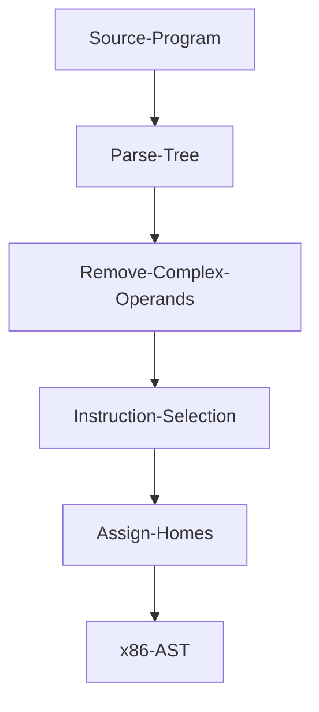

# zettapy
`Zettapy` is do far a small and very limited toy compiler for the core of imperative languages based on the excellent book "Essentials of Compilation" by Dr. Siek. This compiler only compiles very basic programs to an x86 AST.

## Progress
It lowers:
   -   if statements
   -   while loops
   -   assignment
   -   basic arithmetic
   -   tuples; and
   -   high level functions

to a low level AST whose instructions are explicit x86-64 instructions.

### TODO
I still need to implement:
   - if expressions
   - register allocation
   - generate the x86 from x86 AST
   - compile programs with nested non assignment and non primitive statements - i.e this compiler doesnt work at all.

When I am done with this TODO I would have implemented every chapter from the textbook "Essentials of Compilation" by Dr. Siek covered in a quarter compiler course.

If I have time I will implement:
   - lexical scope functions
   - make compiler into a proper dynamic laguage

## Purpose for writing this compiler
This compiler was done for fun and to learn about assembly and low level details. Thanks to this project now I have a rough idea of how the assembly looks for the constructs that I implemented. 


*Work in progress*

## Getting Started
**Dependencies**: 
- SBCL: 

MacOS:`brew install sbcl`

Ubuntu `sudo apt-get install sbcl`

Arch Linux `sudo pacman -S sbcl`
- [Quicklisp](https://www.quicklisp.org/beta/)

**Install**:
`git clone git@github.com:Jobhdez/zettapy.git`

Note: clone this project in `quicklisp/local-projects` so you can load the project with `(ql:quickload :zetta)`.

**Use**:
```
(ql:quickload :zetta)

(in-package :zetta)
```
**Tests**:
```
(ql:quickload :zetta/tests)

(asdf:test-system :zetta)
```

## Architecture

### Intermediate languages
The main intermediate languages are monadic normal form and three address code.

### Passes


## Example

```Lisp
;; parse tree for if 2==2: x = 30 + -10 print(x + 10) else: y = 34 + -2 print(y)
#S(PY-MODULE
   :STATEMENTS (#S(PY-IF
                   :EXP #S(PY-CMP
                           :LEXP #S(PY-CONSTANT :NUM 2)
                           :CMP :==
                           :REXP #S(PY-CONSTANT :NUM 2))
                   :IF-STATEMENT (#S(PY-ASSIGNMENT
                                     :NAME ZETTA-VAR::X
                                     :EXP #S(PY-SUM
                                             :LEXP #S(PY-CONSTANT :NUM 30)
                                             :REXP #S(PY-NEG-NUM
                                                      :NUM #S(PY-CONSTANT
                                                              :NUM 10))))
                                  #S(PY-PRINT
                                     :EXP #S(PY-SUM
                                             :LEXP #S(PY-VAR
                                                      :NAME ZETTA-VAR::X)
                                             :REXP #S(PY-CONSTANT :NUM 10))))
                   :ELSE-STATEMENT (#S(PY-ASSIGNMENT
                                       :NAME ZETTA-VAR::Y
                                       :EXP #S(PY-SUM
                                               :LEXP #S(PY-CONSTANT :NUM 34)
                                               :REXP #S(PY-NEG-NUM
                                                        :NUM #S(PY-CONSTANT
                                                                :NUM 2))))
                                    #S(PY-PRINT
                                       :EXP #S(PY-VAR :NAME ZETTA-VAR::Y))))))
                                       
;; remove complex expressions: converts parse tree to monadic normal form where complex expressions get converted to atomic expressions
(#S(IF-ATOMIC
    :BLOCK "block_1"
    :BEGIN-THEN (#S(ATOMIC-ASSIGNMENT
                    :TEMP-VAR #S(ATOMIC-VAR :NAME "temp_1")
                    :N #S(PY-NEG-NUM :NUM #S(PY-CONSTANT :NUM 10)))
                 #S(PY-ASSIGNMENT
                    :NAME #S(ATOMIC-VAR :NAME ZETTA-VAR::X)
                    :EXP #S(ATOMIC-SUM
                            :LEXP #S(PY-CONSTANT :NUM 30)
                            :REXP #S(ATOMIC-VAR :NAME "temp_1")))
                 #S(ATOMIC-ASSIGNMENT
                    :TEMP-VAR #S(ATOMIC-VAR :NAME "temp_2")
                    :N #S(ATOMIC-SUM
                          :LEXP #S(ATOMIC-VAR
                                   :NAME #S(PY-VAR :NAME ZETTA-VAR::X))
                          :REXP #S(PY-CONSTANT :NUM 10)))
                 #S(PY-PRINT :EXP #S(ATOMIC-VAR :NAME "temp_2")))
    :BEGIN-ELSE (#S(ATOMIC-ASSIGNMENT
                    :TEMP-VAR #S(ATOMIC-VAR :NAME "temp_2")
                    :N #S(PY-NEG-NUM :NUM #S(PY-CONSTANT :NUM 2)))
                 #S(PY-ASSIGNMENT
                    :NAME #S(ATOMIC-VAR :NAME ZETTA-VAR::Y)
                    :EXP #S(ATOMIC-SUM
                            :LEXP #S(PY-CONSTANT :NUM 34)
                            :REXP #S(ATOMIC-VAR :NAME "temp_2")))
                 #S(PY-PRINT
                    :EXP #S(PY-VAR :NAME #S(ATOMIC-VAR :NAME ZETTA-VAR::Y))))
    :CONDITION #S(PY-CMP
                  :LEXP #S(PY-CONSTANT :NUM 2)
                  :CMP :==
                  :REXP #S(PY-CONSTANT :NUM 2))))
                  
;; select instructions: make assembly (x86) instructions explicit
                  
* (clean (select-instructions rmv3))
(#S(INSTRUCTION :NAME "movq" :ARG1 #S(IMMEDIATE :INT 2) :ARG2 "%rsi")
 #S(INSTRUCTION :NAME "movq" :ARG1 #S(IMMEDIATE :INT 2) :ARG2 "%rdi")
 #S(INSTRUCTION :NAME "cmpq" :ARG1 "%rsi" :ARG2 "%rdi")
 #S(INSTRUCTION :NAME "je" :ARG1 "block_1" :ARG2 NO-ARG)
 #S(INSTRUCTION :NAME "jmp" :ARG1 "block_2" :ARG2 NO-ARG)
 #S(BLOCK-PY :NAME "block_1")
 #S(INSTRUCTION :NAME "movq" :ARG1 10 :ARG2 #S(ATOMIC-VAR :NAME "temp_1"))
 #S(INSTRUCTION :NAME "subq" :ARG1 #S(ATOMIC-VAR :NAME "temp_1") :ARG2 NO-ARG)
 #S(INSTRUCTION
    :NAME "movq"
    :ARG1 #S(IMMEDIATE :INT 30)
    :ARG2 #S(ATOMIC-VAR :NAME ZETTA-VAR::X))
 #S(INSTRUCTION
    :NAME "addq"
    :ARG1 #S(ATOMIC-VAR :NAME "temp_1")
    :ARG2 #S(ATOMIC-VAR :NAME ZETTA-VAR::X))
 #S(INSTRUCTION :NAME "movq" :ARG1 10 :ARG2 #S(ATOMIC-VAR :NAME "temp_2"))
 #S(INSTRUCTION
    :NAME "addq"
    :ARG1 #S(ATOMIC-VAR :NAME ZETTA-VAR::X)
    :ARG2 #S(ATOMIC-VAR :NAME "temp_2"))
 #S(CALLQ :LABEL "print_int") #S(BLOCK-PY :NAME "block_2")
 #S(INSTRUCTION :NAME "movq" :ARG1 2 :ARG2 #S(ATOMIC-VAR :NAME "temp_2"))
 #S(INSTRUCTION :NAME "subq" :ARG1 #S(ATOMIC-VAR :NAME "temp_2") :ARG2 NO-ARG)
 #S(INSTRUCTION
    :NAME "movq"
    :ARG1 #S(IMMEDIATE :INT 34)
    :ARG2 #S(ATOMIC-VAR :NAME ZETTA-VAR::Y))
 #S(INSTRUCTION
    :NAME "addq"
    :ARG1 #S(ATOMIC-VAR :NAME "temp_2")
    :ARG2 #S(ATOMIC-VAR :NAME ZETTA-VAR::Y))
 #S(CALLQ :LABEL "print_int"))
 
;; assign stack locations
* (assign-homes (clean (select-instructions rmv3)))
(#S(INSTRUCTION :NAME "movq" :ARG1 #S(IMMEDIATE :INT 2) :ARG2 "%rsi")
 #S(INSTRUCTION :NAME "movq" :ARG1 #S(IMMEDIATE :INT 2) :ARG2 "%rdi")
 #S(INSTRUCTION :NAME "cmpq" :ARG1 "%rsi" :ARG2 "%rdi")
 #S(INSTRUCTION :NAME "je" :ARG1 "block_1" :ARG2 NO-ARG)
 #S(INSTRUCTION :NAME "jmp" :ARG1 "block_2" :ARG2 NO-ARG)
 #S(BLOCK-PY :NAME "block_1")
 #S(INSTRUCTION :NAME "movq" :ARG1 10 :ARG2 "-8(%rbp)")
 #S(INSTRUCTION :NAME "subq" :ARG1 "-8(%rbp)" :ARG2 NO-ARG)
 #S(INSTRUCTION :NAME "movq" :ARG1 #S(IMMEDIATE :INT 30) :ARG2 "-16(%rbp)")
 #S(INSTRUCTION :NAME "addq" :ARG1 "-8(%rbp)" :ARG2 "-16(%rbp)")
 #S(INSTRUCTION :NAME "movq" :ARG1 10 :ARG2 "-24(%rbp)")
 #S(INSTRUCTION :NAME "addq" :ARG1 "-16(%rbp)" :ARG2 "-24(%rbp)")
 #S(CALLQ :LABEL "print_int") #S(BLOCK-PY :NAME "block_2")
 #S(INSTRUCTION :NAME "movq" :ARG1 2 :ARG2 "-24(%rbp)")
 #S(INSTRUCTION :NAME "subq" :ARG1 "-24(%rbp)" :ARG2 NO-ARG)
 #S(INSTRUCTION :NAME "movq" :ARG1 #S(IMMEDIATE :INT 34) :ARG2 "-32(%rbp)")
 #S(INSTRUCTION :NAME "addq" :ARG1 "-24(%rbp)" :ARG2 "-32(%rbp)")
 #S(CALLQ :LABEL "print_int"))

```
## Disclaimer
Currently, the compiler generates a low level ast consisting of explicit x86 instructions so you will not be able to run the assembly yet 

## Acknowledgements
this compiler is loosely based on the Python compiler skeleton (written in Python) in the textbook [Essentials of Compilation](https://github.com/IUCompilerCourse/Essentials-of-Compilation). None of the Python code was ported into common lisp. I essentially solved the exercises and wrote my code in a different language.

thanks
