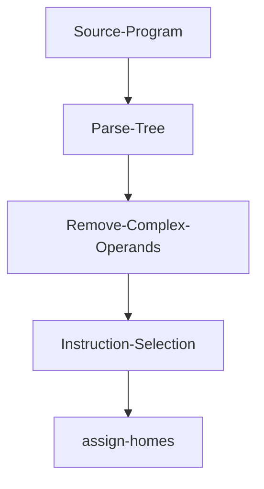

# zettapy
`Zettapy` is a small toy compiler for the core of imperative languages. It compiles Python syntax although it is not really Python3.

## State of the compiler
It lowers if statements, while loops, assignment, basic arithmetic, tuples, and high level functions to a low level ast whose instructions are explicit x86-64 instructions.

## Purpose for writing this compiler
This compiler was done for fun and to learn about assembly and low level details. Thanks to this project now I have a rough idea of how the assembly looks for the constructs that I implemented. 


*Work in progress*

## Getting Started
**Dependencies**: 
- SBCL: MacOS:`brew install sbcl`; Ubuntu `sudo apt-get install sbcl`
- [Quicklisp](https://www.quicklisp.org/beta/)

**Install**:
`git clone git@github.com:Jobhdez/zettapy.git`

Note: clone this project in `quicklisp/local-projects` so you can load the project with `(ql:quickload :zetta)`.

**Use**:
```
(ql:quickload :zetta)

(in-package :zetta)
```
**test**
```
(ql:quickload :zetta/tests)
(asdf:test-system :zetta)
```

## Architecture

### Intermediate languages
The main intermediate languages are monadic normal form and three address code.

### Passes



## Disclaimer
Currently, the compiler generates a low level ast consisting of explicit x86 instructions so you will not be able to run the assembly yet 

## Acknowledgements
this compiler is loosely based on the Python compiler skeleton (written in Python) in the textbook [Essentials of Compilation](https://github.com/IUCompilerCourse/Essentials-of-Compilation). None of the Python code was ported into common lisp. I essentially solved the exercises and wrote my code in a different language.

thanks
