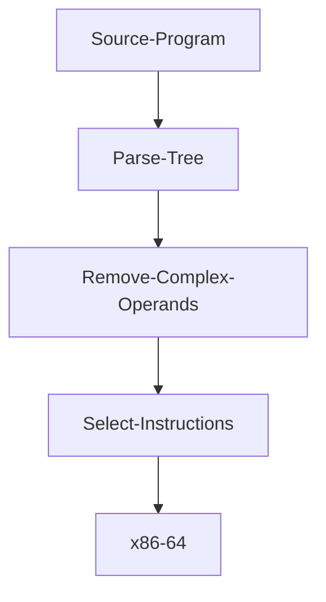

# zettapy
python compiler

Compiler for a subset of python3 or at least a compiler for a python like language :-)

Work in progress

## Architecture

```mermaid
graph TD;
    Source-Program-->Parse-Tree;
    Parse-Tree-->Remove-Complex-Operands;
    Remove-Complex-Operands-->Select-Instructions;
    Select-Instructions-->x86-64;
```

