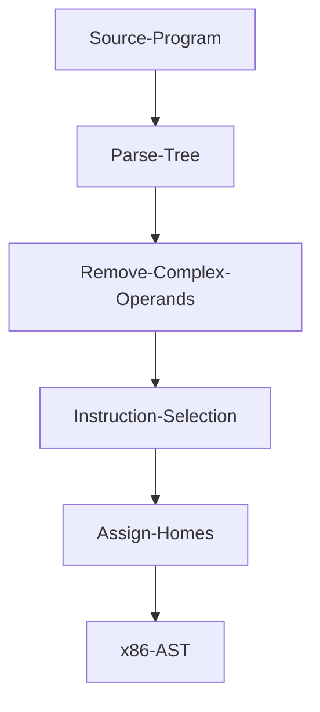

# Core


`core` is a small compiler that lowers core imperative programming features to runnable x86. It supports: variables, assignment, if statements, while loops.

*note* dev is in progress ...

## Getting Started
**Dependencies**: 
- SBCL: 

MacOS:`brew install sbcl`

Ubuntu `sudo apt-get install sbcl`

Arch Linux `sudo pacman -S sbcl`
- [Quicklisp](https://www.quicklisp.org/beta/)

**Install**:
`git clone git@github.com:Jobhdez/zettapy.git`

Note: clone this project in `quicklisp/local-projects` so you can load the project with `(ql:quickload :zetta)`.

**Use**:
```
(ql:quickload :zetta)

(in-package :zetta)
```
**Tests**:
```
(ql:quickload :zetta/tests)

(asdf:test-system :zetta)
```

## Architecture

### Intermediate languages
The main intermediate languages are monadic normal form and three address code.

### Passes


## Example

```
def test(x y):
   n = 10
   while x < 20:
      if x < n:
         j = 10 + -3
	 print(j+10)
         x=x+1
       else:
         j = 10 + -6
	 print(j + 3)
         x = x+1;;
```

Compiles to the following x86 AST:

```
(#S(INSTRUCTION :NAME "movq" :ARG1 "rdi" :ARG2 "-8(%rbp)")
 #S(INSTRUCTION :NAME "movq" :ARG1 "rsi" :ARG2 "-16(%rbp)")
 #S(INSTRUCTION :NAME "movq" :ARG1 #S(IMMEDIATE :INT 10) :ARG2 "-24(%rbp)")
 #S(INSTRUCTION :NAME "jmp" :ARG1 "test" :ARG2 NO-ARG)
 #S(INSTRUCTION :NAME "jg" :ARG1 "loop" :ARG2 NO-ARG)
 #S(BLOCK-PY :NAME "loop:")
 #S(INSTRUCTION :NAME "cmpq" :ARG1 "-24(%rbp)" :ARG2 "-8(%rbp)")
 #S(INSTRUCTION :NAME "je" :ARG1 "block_1" :ARG2 NO-ARG)
 #S(INSTRUCTION :NAME "jmp" :ARG1 "block_2" :ARG2 NO-ARG)
 #S(BLOCK-PY :NAME "block_1")
 #S(INSTRUCTION :NAME "movq" :ARG1 3 :ARG2 "-32(%rbp)")
 #S(INSTRUCTION :NAME "subq" :ARG1 "-32(%rbp)" :ARG2 NO-ARG)
 #S(INSTRUCTION :NAME "movq" :ARG1 #S(IMMEDIATE :INT 10) :ARG2 "-40(%rbp)")
 #S(INSTRUCTION :NAME "addq" :ARG1 "-32(%rbp)" :ARG2 "-40(%rbp)")
 #S(INSTRUCTION :NAME "movq" :ARG1 10 :ARG2 "-48(%rbp)")
 #S(INSTRUCTION :NAME "addq" :ARG1 "-40(%rbp)" :ARG2 "-48(%rbp)")
 #S(CALLQ :LABEL "print_int") #S(BLOCK-PY :NAME "block_2")
 #S(INSTRUCTION :NAME "movq" :ARG1 6 :ARG2 "-48(%rbp)")
 #S(INSTRUCTION :NAME "subq" :ARG1 "-48(%rbp)" :ARG2 NO-ARG)
 #S(INSTRUCTION :NAME "movq" :ARG1 #S(IMMEDIATE :INT 10) :ARG2 "-40(%rbp)")
 #S(INSTRUCTION :NAME "addq" :ARG1 "-48(%rbp)" :ARG2 "-40(%rbp)")
 #S(INSTRUCTION :NAME "movq" :ARG1 3 :ARG2 "-56(%rbp)")
 #S(INSTRUCTION :NAME "addq" :ARG1 "-40(%rbp)" :ARG2 "-56(%rbp)")
 #S(CALLQ :LABEL "print_int") #S(BLOCK-PY :NAME "test:")
 #S(INSTRUCTION :NAME "cmpq" :ARG1 #S(IMMEDIATE :INT 20) :ARG2 "-8(%rbp)"))
```

The above x86 AST is a bit off. The x86 should look like this (an example that runs):

```assembly
	.globl main
main:
	pushq %rbp
	movq %rsp, %rbp
	subq $48, %rsp
	movq $10, %rbx
	movq $0, %r15
	jmp test

test:
	cmpq $20, %r15
	jge exit

	cmp %rbx, %r15
	jl block_1
	jmp block_2
block_1:	
	movq $10, -8(%rbp)
	movq $3, -16(%rbp)
	negq -16(%rbp)
	movq -16(%rbp), %rax
	addq -8(%rbp), %rax
	movq $10, -32(%rbp)
	addq -32(%rbp), %rax
	movq %rax, %rdi
	callq print_int
	incq %r15
	jmp test

block_2:
	movq $10, -8(%rbp)
	movq $6, -16(%rbp)
	negq -16(%rbp)
	movq -16(%rbp), %rax
	addq -8(%rbp), %rax
	movq %rax, %rdi
	callq print_int
	incq %r15
	jmp test
	

exit:
	addq $48, %rsp
	popq %rbp
	retq
	
```
## Acknowledgements
This compiler is loosely based on the Python compiler skeleton (written in Python) in the textbook [Essentials of Compilation](https://github.com/IUCompilerCourse/Essentials-of-Compilation). None of the Python code was ported into common lisp. I essentially solved the exercises and wrote my code in a different language.

thanks
