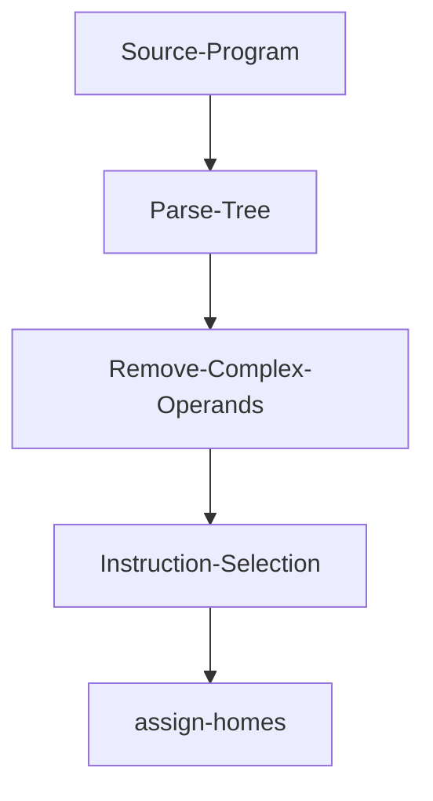

# zettapy
`Zettapy` is a small toy compiler for the core of imperative languages (i.e., loops, if statements, variables, assignment). Currently, it compiles assignment, integer arithmetic, if statements, and while loops to a low level ast; the low level ast consists of the x86 instructions but the instructions do not adhere to the x86 rule that arguments cannot be both stack locations. Tuples are also compiled to a low level ast.

## Plan
Implement if expressions, tuples, and arrays, and functions and register allocation and have the generated assembly run.

## Purpose for writing this compiler
This compiler was done for fun and to learn about assembly and low level details. Thanks to this project now I have a rough idea of how the assembly looks for the constructs that I implemented. 

Although, there are no tests I tested my code as I wrote it. You can see the examples that run in the `examples.txt` file. But I will implement tests soon.

*Work in progress*

## Getting Started
**Dependencies**: 
- SBCL: MacOS:`brew install sbcl`; Ubuntu `sudo apt-get install sbcl`
- [Quicklisp](https://www.quicklisp.org/beta/)

**Install**:
`git clone git@github.com:Jobhdez/zettapy.git`

Note: clone this project in `quicklisp/local-projects` so you can load the project with `(ql:quickload :zetta)`.

**Use**:
```
(ql:quickload :zetta)

(in-package :zetta)
```

## Architecture



## Disclaimer
Currently, the compiler generates a low level ast consisting of explicit x86 instructions so you will not be able to run the assembly yet 

## Acknowledgements
this compiler is loosely based on the Python compiler skeleton (written in Python) in the textbook [Essentials of Compilation](https://github.com/IUCompilerCourse/Essentials-of-Compilation). None of the Python code was ported into common lisp. I essentially solved the exercises and wrote my code in a different language.

thanks
