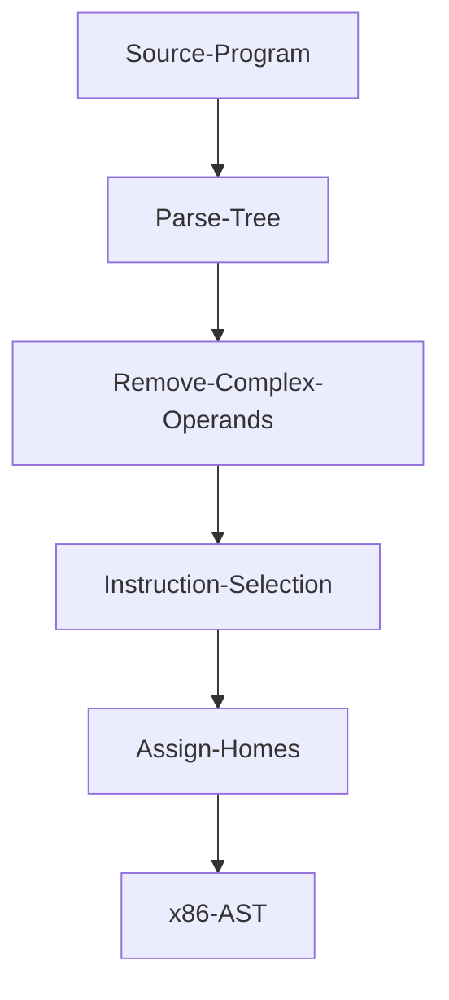

# zettapy
`Zettapy` is a small and very limited toy compiler for the core of imperative languages based on the excellent book "Essentials of Compilation" by Dr. Siek. This compiler only compiles very basic programs to an x86 AST. In other words this project was a quick experiment and since it generates an x86 AST this generated code is not meant to be run.

It lowers:
   -   if statements
   -   while loops
   -   assignment
   -   basic arithmetic
   -   tuples; and
   -   high level functions

to a low level AST whose instructions are explicit x86-64 instructions.

## Purpose for writing this compiler
This compiler was done for fun and to learn about assembly and low level details. Thanks to this project now I have a rough idea of how the assembly looks for the constructs that I implemented. This project was a quick experiment to get an idea of how to to build a compiler. My initial intention was to quickly generate the x86 AST for some simple programs -- i.e., the constructs above in isolation. As a result, nested constructs cannot be compiled.

## Lessons
If I were to start from scratch this what I would do differently. While building this compiler I was too narrow focused; that is I was thinking very concretely and in specific use cases; for example, I only tested if statements in isolation but I never tested an if statement with nested if statements or a while loop with nested if statements and so on. I think if I would have been more general in my approach I would have captured a pattern.

Another thing I am learning is that your technical decisions will follow you, so to speak, thoughout the developement of the project; for example, in this project I would have to re-write a lot of things to do it the correct way. So good decisions in the beginning of the development process leads to better maintainment.

I also did not construct the ast properly and so I had to hack things together in later passes; for instance `cpm` is not contructed properly. In addition, assignment was not constructed.

## Getting Started
**Dependencies**: 
- SBCL: 

MacOS:`brew install sbcl`

Ubuntu `sudo apt-get install sbcl`

Arch Linux `sudo pacman -S sbcl`
- [Quicklisp](https://www.quicklisp.org/beta/)

**Install**:
`git clone git@github.com:Jobhdez/zettapy.git`

Note: clone this project in `quicklisp/local-projects` so you can load the project with `(ql:quickload :zetta)`.

**Use**:
```
(ql:quickload :zetta)

(in-package :zetta)
```
**Tests**:
```
(ql:quickload :zetta/tests)

(asdf:test-system :zetta)
```

## Architecture

### Intermediate languages
The main intermediate languages are monadic normal form and three address code.

### Passes


## Example

```Lisp
;; parse tree for if 2==2: x = 30 + -10 print(x + 10) else: y = 34 + -2 print(y)
#S(PY-MODULE
   :STATEMENTS (#S(PY-IF
                   :EXP #S(PY-CMP
                           :LEXP #S(PY-CONSTANT :NUM 2)
                           :CMP :==
                           :REXP #S(PY-CONSTANT :NUM 2))
                   :IF-STATEMENT (#S(PY-ASSIGNMENT
                                     :NAME ZETTA-VAR::X
                                     :EXP #S(PY-SUM
                                             :LEXP #S(PY-CONSTANT :NUM 30)
                                             :REXP #S(PY-NEG-NUM
                                                      :NUM #S(PY-CONSTANT
                                                              :NUM 10))))
                                  #S(PY-PRINT
                                     :EXP #S(PY-SUM
                                             :LEXP #S(PY-VAR
                                                      :NAME ZETTA-VAR::X)
                                             :REXP #S(PY-CONSTANT :NUM 10))))
                   :ELSE-STATEMENT (#S(PY-ASSIGNMENT
                                       :NAME ZETTA-VAR::Y
                                       :EXP #S(PY-SUM
                                               :LEXP #S(PY-CONSTANT :NUM 34)
                                               :REXP #S(PY-NEG-NUM
                                                        :NUM #S(PY-CONSTANT
                                                                :NUM 2))))
                                    #S(PY-PRINT
                                       :EXP #S(PY-VAR :NAME ZETTA-VAR::Y))))))
                                       
;; remove complex expressions: converts parse tree to monadic normal form where complex expressions get converted to atomic expressions
(#S(IF-ATOMIC
    :BLOCK "block_1"
    :BEGIN-THEN (#S(ATOMIC-ASSIGNMENT
                    :TEMP-VAR #S(ATOMIC-VAR :NAME "temp_1")
                    :N #S(PY-NEG-NUM :NUM #S(PY-CONSTANT :NUM 10)))
                 #S(PY-ASSIGNMENT
                    :NAME #S(ATOMIC-VAR :NAME ZETTA-VAR::X)
                    :EXP #S(ATOMIC-SUM
                            :LEXP #S(PY-CONSTANT :NUM 30)
                            :REXP #S(ATOMIC-VAR :NAME "temp_1")))
                 #S(ATOMIC-ASSIGNMENT
                    :TEMP-VAR #S(ATOMIC-VAR :NAME "temp_2")
                    :N #S(ATOMIC-SUM
                          :LEXP #S(ATOMIC-VAR
                                   :NAME #S(PY-VAR :NAME ZETTA-VAR::X))
                          :REXP #S(PY-CONSTANT :NUM 10)))
                 #S(PY-PRINT :EXP #S(ATOMIC-VAR :NAME "temp_2")))
    :BEGIN-ELSE (#S(ATOMIC-ASSIGNMENT
                    :TEMP-VAR #S(ATOMIC-VAR :NAME "temp_2")
                    :N #S(PY-NEG-NUM :NUM #S(PY-CONSTANT :NUM 2)))
                 #S(PY-ASSIGNMENT
                    :NAME #S(ATOMIC-VAR :NAME ZETTA-VAR::Y)
                    :EXP #S(ATOMIC-SUM
                            :LEXP #S(PY-CONSTANT :NUM 34)
                            :REXP #S(ATOMIC-VAR :NAME "temp_2")))
                 #S(PY-PRINT
                    :EXP #S(PY-VAR :NAME #S(ATOMIC-VAR :NAME ZETTA-VAR::Y))))
    :CONDITION #S(PY-CMP
                  :LEXP #S(PY-CONSTANT :NUM 2)
                  :CMP :==
                  :REXP #S(PY-CONSTANT :NUM 2))))
                  
;; select instructions: make assembly (x86) instructions explicit
                  
* (clean (select-instructions rmv3))
(#S(INSTRUCTION :NAME "movq" :ARG1 #S(IMMEDIATE :INT 2) :ARG2 "%rsi")
 #S(INSTRUCTION :NAME "movq" :ARG1 #S(IMMEDIATE :INT 2) :ARG2 "%rdi")
 #S(INSTRUCTION :NAME "cmpq" :ARG1 "%rsi" :ARG2 "%rdi")
 #S(INSTRUCTION :NAME "je" :ARG1 "block_1" :ARG2 NO-ARG)
 #S(INSTRUCTION :NAME "jmp" :ARG1 "block_2" :ARG2 NO-ARG)
 #S(BLOCK-PY :NAME "block_1")
 #S(INSTRUCTION :NAME "movq" :ARG1 10 :ARG2 #S(ATOMIC-VAR :NAME "temp_1"))
 #S(INSTRUCTION :NAME "subq" :ARG1 #S(ATOMIC-VAR :NAME "temp_1") :ARG2 NO-ARG)
 #S(INSTRUCTION
    :NAME "movq"
    :ARG1 #S(IMMEDIATE :INT 30)
    :ARG2 #S(ATOMIC-VAR :NAME ZETTA-VAR::X))
 #S(INSTRUCTION
    :NAME "addq"
    :ARG1 #S(ATOMIC-VAR :NAME "temp_1")
    :ARG2 #S(ATOMIC-VAR :NAME ZETTA-VAR::X))
 #S(INSTRUCTION :NAME "movq" :ARG1 10 :ARG2 #S(ATOMIC-VAR :NAME "temp_2"))
 #S(INSTRUCTION
    :NAME "addq"
    :ARG1 #S(ATOMIC-VAR :NAME ZETTA-VAR::X)
    :ARG2 #S(ATOMIC-VAR :NAME "temp_2"))
 #S(CALLQ :LABEL "print_int") #S(BLOCK-PY :NAME "block_2")
 #S(INSTRUCTION :NAME "movq" :ARG1 2 :ARG2 #S(ATOMIC-VAR :NAME "temp_2"))
 #S(INSTRUCTION :NAME "subq" :ARG1 #S(ATOMIC-VAR :NAME "temp_2") :ARG2 NO-ARG)
 #S(INSTRUCTION
    :NAME "movq"
    :ARG1 #S(IMMEDIATE :INT 34)
    :ARG2 #S(ATOMIC-VAR :NAME ZETTA-VAR::Y))
 #S(INSTRUCTION
    :NAME "addq"
    :ARG1 #S(ATOMIC-VAR :NAME "temp_2")
    :ARG2 #S(ATOMIC-VAR :NAME ZETTA-VAR::Y))
 #S(CALLQ :LABEL "print_int"))
 
;; assign stack locations
* (assign-homes (clean (select-instructions rmv3)))
(#S(INSTRUCTION :NAME "movq" :ARG1 #S(IMMEDIATE :INT 2) :ARG2 "%rsi")
 #S(INSTRUCTION :NAME "movq" :ARG1 #S(IMMEDIATE :INT 2) :ARG2 "%rdi")
 #S(INSTRUCTION :NAME "cmpq" :ARG1 "%rsi" :ARG2 "%rdi")
 #S(INSTRUCTION :NAME "je" :ARG1 "block_1" :ARG2 NO-ARG)
 #S(INSTRUCTION :NAME "jmp" :ARG1 "block_2" :ARG2 NO-ARG)
 #S(BLOCK-PY :NAME "block_1")
 #S(INSTRUCTION :NAME "movq" :ARG1 10 :ARG2 "-8(%rbp)")
 #S(INSTRUCTION :NAME "subq" :ARG1 "-8(%rbp)" :ARG2 NO-ARG)
 #S(INSTRUCTION :NAME "movq" :ARG1 #S(IMMEDIATE :INT 30) :ARG2 "-16(%rbp)")
 #S(INSTRUCTION :NAME "addq" :ARG1 "-8(%rbp)" :ARG2 "-16(%rbp)")
 #S(INSTRUCTION :NAME "movq" :ARG1 10 :ARG2 "-24(%rbp)")
 #S(INSTRUCTION :NAME "addq" :ARG1 "-16(%rbp)" :ARG2 "-24(%rbp)")
 #S(CALLQ :LABEL "print_int") #S(BLOCK-PY :NAME "block_2")
 #S(INSTRUCTION :NAME "movq" :ARG1 2 :ARG2 "-24(%rbp)")
 #S(INSTRUCTION :NAME "subq" :ARG1 "-24(%rbp)" :ARG2 NO-ARG)
 #S(INSTRUCTION :NAME "movq" :ARG1 #S(IMMEDIATE :INT 34) :ARG2 "-32(%rbp)")
 #S(INSTRUCTION :NAME "addq" :ARG1 "-24(%rbp)" :ARG2 "-32(%rbp)")
 #S(CALLQ :LABEL "print_int"))

```

## Acknowledgements
This compiler is loosely based on the Python compiler skeleton (written in Python) in the textbook [Essentials of Compilation](https://github.com/IUCompilerCourse/Essentials-of-Compilation). None of the Python code was ported into common lisp. I essentially solved the exercises and wrote my code in a different language.

thanks
