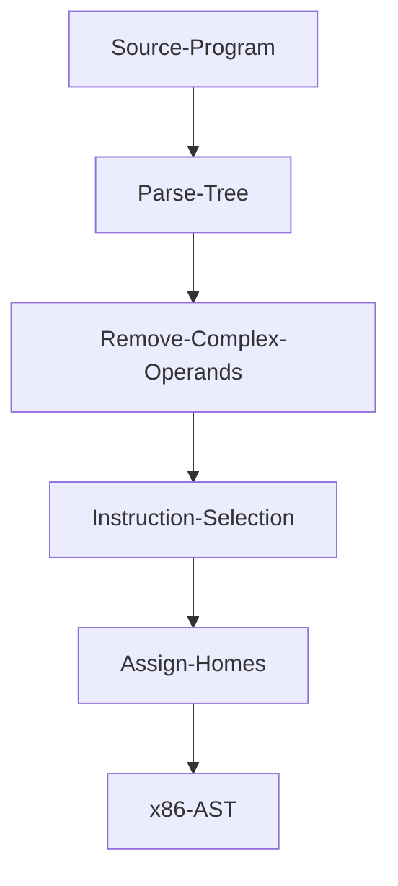

# zettapy
`Zettapy` is a small and very limited toy compiler for the core of imperative languages based on the excellent book "Essentials of Compilation" by Dr. Siek. This compiler only compiles very basic programs to an x86 AST. In other words this project was a quick experiment and since it generates an x86 AST this generated code is not meant to be run.

It lowers:
   -   if statements
   -   while loops
   -   assignment
   -   basic arithmetic
   -   tuples; and
   -   top level functions

to a low level AST whose instructions are explicit x86-64 instructions.

## Purpose for writing this compiler
This compiler was done for fun and to learn about assembly and low level details. Thanks to this project now I have a rough idea of how the assembly looks for the constructs that I implemented. This project was a quick experiment to get an idea of how to to build a compiler. My initial intention was to quickly generate the x86 AST for some simple programs.

## Getting Started
**Dependencies**: 
- SBCL: 

MacOS:`brew install sbcl`

Ubuntu `sudo apt-get install sbcl`

Arch Linux `sudo pacman -S sbcl`
- [Quicklisp](https://www.quicklisp.org/beta/)

**Install**:
`git clone git@github.com:Jobhdez/zettapy.git`

Note: clone this project in `quicklisp/local-projects` so you can load the project with `(ql:quickload :zetta)`.

**Use**:
```
(ql:quickload :zetta)

(in-package :zetta)
```
**Tests**:
```
(ql:quickload :zetta/tests)

(asdf:test-system :zetta)
```

## Architecture

### Intermediate languages
The main intermediate languages are monadic normal form and three address code.

### Passes


## Example

```
def test(x y):
   n = 10
   while x < 20:
      if x < n:
         j = 10 + -3
	 print(j+10)
       else:
         j = 10 + -6
	 print(j + 3);;
```

Compiles to the following x86 AST:

```
(#S(INSTRUCTION :NAME "movq" :ARG1 "rdi" :ARG2 "-8(%rbp)")
 #S(INSTRUCTION :NAME "movq" :ARG1 "rsi" :ARG2 "-16(%rbp)")
 #S(INSTRUCTION :NAME "movq" :ARG1 #S(IMMEDIATE :INT 10) :ARG2 "-24(%rbp)")
 #S(INSTRUCTION :NAME "jmp" :ARG1 "test" :ARG2 NO-ARG)
 #S(INSTRUCTION :NAME "jg" :ARG1 "loop" :ARG2 NO-ARG)
 #S(BLOCK-PY :NAME "loop:")
 #S(INSTRUCTION :NAME "cmpq" :ARG1 "-24(%rbp)" :ARG2 "-8(%rbp)")
 #S(INSTRUCTION :NAME "je" :ARG1 "block_1" :ARG2 NO-ARG)
 #S(INSTRUCTION :NAME "jmp" :ARG1 "block_2" :ARG2 NO-ARG)
 #S(BLOCK-PY :NAME "block_1")
 #S(INSTRUCTION :NAME "movq" :ARG1 3 :ARG2 "-32(%rbp)")
 #S(INSTRUCTION :NAME "subq" :ARG1 "-32(%rbp)" :ARG2 NO-ARG)
 #S(INSTRUCTION :NAME "movq" :ARG1 #S(IMMEDIATE :INT 10) :ARG2 "-40(%rbp)")
 #S(INSTRUCTION :NAME "addq" :ARG1 "-32(%rbp)" :ARG2 "-40(%rbp)")
 #S(INSTRUCTION :NAME "movq" :ARG1 10 :ARG2 "-48(%rbp)")
 #S(INSTRUCTION :NAME "addq" :ARG1 "-40(%rbp)" :ARG2 "-48(%rbp)")
 #S(CALLQ :LABEL "print_int") #S(BLOCK-PY :NAME "block_2")
 #S(INSTRUCTION :NAME "movq" :ARG1 6 :ARG2 "-48(%rbp)")
 #S(INSTRUCTION :NAME "subq" :ARG1 "-48(%rbp)" :ARG2 NO-ARG)
 #S(INSTRUCTION :NAME "movq" :ARG1 #S(IMMEDIATE :INT 10) :ARG2 "-40(%rbp)")
 #S(INSTRUCTION :NAME "addq" :ARG1 "-48(%rbp)" :ARG2 "-40(%rbp)")
 #S(INSTRUCTION :NAME "movq" :ARG1 3 :ARG2 "-56(%rbp)")
 #S(INSTRUCTION :NAME "addq" :ARG1 "-40(%rbp)" :ARG2 "-56(%rbp)")
 #S(CALLQ :LABEL "print_int") #S(BLOCK-PY :NAME "test:")
 #S(INSTRUCTION :NAME "cmpq" :ARG1 #S(IMMEDIATE :INT 20) :ARG2 "-8(%rbp)"))
```

## Acknowledgements
This compiler is loosely based on the Python compiler skeleton (written in Python) in the textbook [Essentials of Compilation](https://github.com/IUCompilerCourse/Essentials-of-Compilation). None of the Python code was ported into common lisp. I essentially solved the exercises and wrote my code in a different language.

thanks
