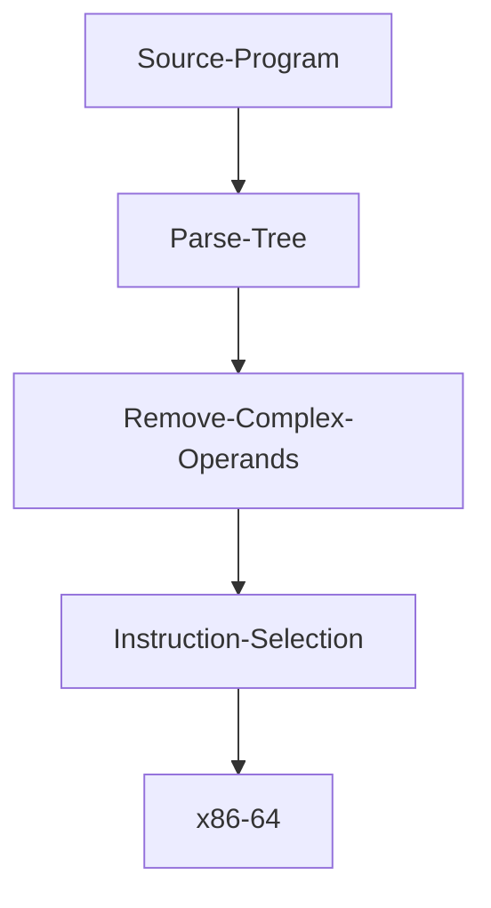

# zettapy
`Zettapy` is a small toy compiler for the core of imperative languages (i.e., loops, if statements, variables, assignment). It attempts to emit x86-64. so far variables, and assignment -- e.g., `x = 50 + -30 print(x + 10)` compiles to assembly instructions in which the variables are in registers or stack locations. But the stack locations are a bit off; I believe the instructions are mostly correct but the stack locations are off by a bit and since I use global variables the stack locations are off by a lot in subsequent runs of the program. With respect to `while loops` and `if statements` -- these get compiled to instructions via the `instruction selection` module so that means that there is no mention of registers or the stack in these instructions, but nevertheles, the structure of the assembly is there.

This compiler was done for fun and to learn about assembly and low level details. Thanks to this project now I have a rough idea of how the assembly looks for the constructs that I implemented. 

Although, there are no tests I tested my code as I wrote it. You can see the examples that run in the `examples.txt` file.

*Work in progress*

## Getting Started
**Dependencies**: 
- SBCL: MacOS:`brew install sbcl`; Ubuntu `sudo apt-get install sbcl`
- [Quicklisp](https://www.quicklisp.org/beta/)

**Install**:
`git clone git@github.com:Jobhdez/zettapy.git`

Note: clone this project in `quicklisp/local-projects` so you can load the project with `(ql:quickload :yotta)`.

**Use**:
```
(ql:quickload :zetta)

(in-package :zetta)
```

## Architecture



## Disclaimer
The assembly generated by this compiler was not meant to be executed. The purpose of building this compiler was to generate mostly correct assembly so I could get a rough idea of how things work. This compiler has served my needs. I plan to make a better compiler next time.

## Acknowledgements
this compiler is loosely based on the Python compiler skeleton (written in Python) in the textbook [Essentials of Compilation](https://github.com/IUCompilerCourse/Essentials-of-Compilation). None of the Python code was ported into common lisp. I essentially solved the exercises and wrote my code in a different language.

thanks
