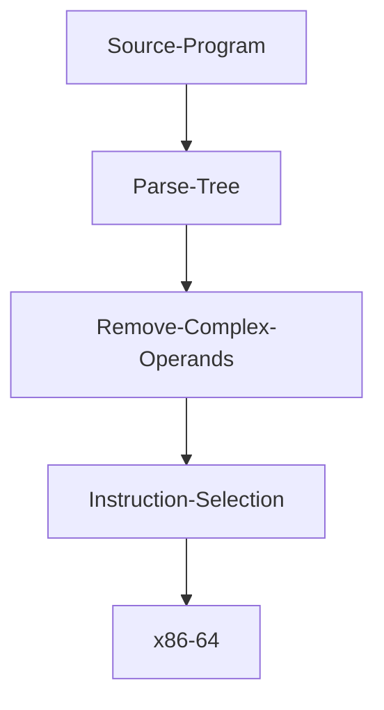

# zettapy
python compiler

Compiler for a subset of python3 or at least a compiler for a python like language :-)

*Work in progress*

## Getting Started
**Dependencies**: 
- SBCL: MacOS:`brew install sbcl`; Ubuntu `sudo apt-get install sbcl`
- [Quicklisp](https://www.quicklisp.org/beta/)

**Install**:
`git clone git@github.com:Jobhdez/zettapy.git`

Note: clone this project in `quicklisp/local-projects` so you can load the project with `(ql:quickload :yotta)`.

**Use**:
```
(ql:quickload :zetta)

(in-package :zetta)
```

### Architecture



